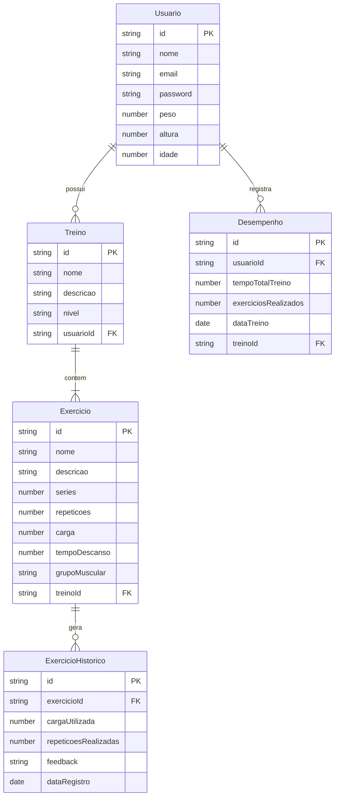

# capivaPump - Sistema Inteligente de Gerenciamento de Treinos

## Sobre o Projeto
TreinoApp é uma aplicação web desenvolvida em Angular para gerenciamento inteligente de treinos, focada em proporcionar uma experiência personalizada para praticantes de musculação.

## Características Principais

### Segurança
- Autenticação JWT
- Proteção de rotas
- Criptografia de dados sensíveis
- Gerenciamento seguro de sessões

### Sistema Inteligente de Cargas
- Ajuste automático de cargas baseado no desempenho
- Feedback em tempo real durante os exercícios
- Sugestões personalizadas de progressão

### Monitoramento de Desempenho
- Gráficos detalhados de evolução
- Histórico completo de treinos
- Métricas de progressão por exercício
- Análise de volume e intensidade

## Tecnologias Utilizadas
- Angular 17
- TypeScript
- Java Spring Boot
- PostgreSQL
- JWT Authentication

## Diagrama 

